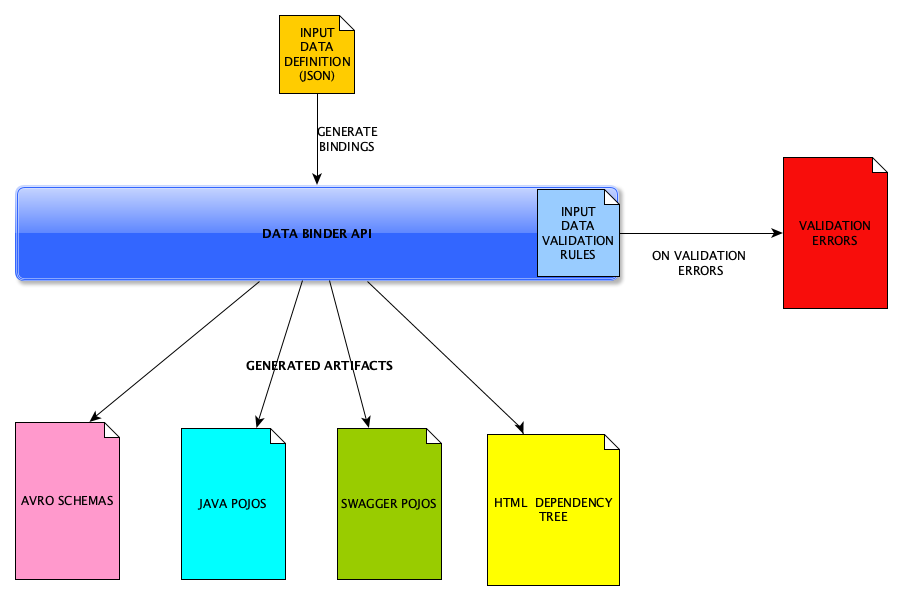
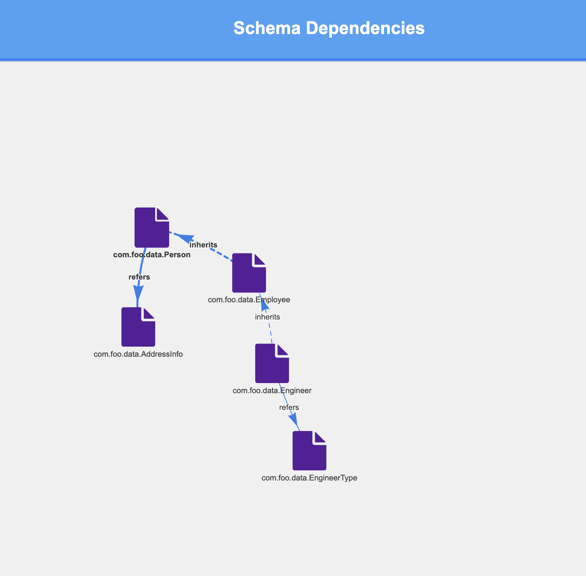

# Data Binding Utility.

## What does it do?
A simple utility where the data is defined in a simple technology-agnostic JSON based on which binding files such as
* Avro Schemas
* Plain Java POJOS
* Swagger API Java POJOS
* HTML Dependency Tree of the data
are automatically generated.

The agnostic JSON acts as the schemata for generating all the binding artifacts.



## How does a JSON data definition look like?

### Simple Definition where a type refers to external types.
```
{
  "qualifiedName": "com.foo.data.Person",
  "version": "1",
  "type": "object",
  "documentation": "A Person Type",
  "tags": [
    "person"
  ],
  "fields": [
    {
      "name": "name",
      "type": "string",
      "documentation": "Name",
      "required": true
    },
    {
      "name": "addressInfo",
      "type": "com.foo.data.AddressInfo",
      "documentation": "Address Info",
      "required": true
    }
  ]
}
```
### Simple Definition where a type extends another type (inheritance).
```
{
  "qualifiedName": "com.foo.data.Employee",
  "version": "1",
  "type": "object",
  "documentation": "A Employee Type",
  "baseType": "com.foo.data.Person",
  "tags": [
    "employee"
  ],
  "fields": [
    {
      "name": "employeeId",
      "type": "string",
      "documentation": "Employee ID",
      "required": true
    }
  ]
}
``` 

### Simple Definition with an array type.
```
{
  "qualifiedName": "com.foo.data.Engineer",
  "version": "1",
  "type": "object",
  "documentation": "A Engineer",
  "baseType": "com.foo.data.Employee",
  "topLevelContainerType": true,
  "identifierFields": ["employeeId", "type", "department"],
  "tags": [
    "engineer"
  ],
  "fields": [
    {
      "name": "department",
      "type": "string",
      "documentation": "Department"
    },
    {
      "name": "type",
      "type": "com.foo.data.EngineerType",
      "required": false
    },
    {
      "name": "phoneNumbers",
      "type": "string",
      "array": true,
      "required": false
    }
  ]
}
```

### Simple Definition of an enumerated type (enum).
```
{
  "qualifiedName": "com.foo.data.EngineerType",
  "version": "1",
  "type": "enumeration",
  "documentation": "A Engineer Type",
  "tags": [
    "engineerType"
  ],
  "enumeratedValues": [
    "BiographicSubmission",
    "BiographicAndBiometricSubmission",
    "BiometricLiveCapture"
  ]
}
```

## Data Types:
As you see in above examples, a field can refer to another type.
In addition to that, the following primitive types are supported.
* string
* int
* long
* double
* float
* boolean

## Validations Framework
The utility comes with an extremely flexible rule based validations framework that lets you write your validation
rules on the data definitions. By this way you always maintain a strict guidelines and standards on how the data is defined
in your organisation.
The validation rules are written in JSON and uses "MVEL expressions" to evaluate on the JSON definition.

For example:
```
{
  "name": "data types validation rules",
  "description": "data types validation rules based on the company guidelines",
  "validationRules": [
    {
      "name": "Missing Version.",
      "description": "Version is missing",
      "errorCondition": "doc.version == null",
      "severity": "Critical"
    },
    {
      "name": "Missing Documentation.",
      "description": "Documentation is missing",
      "errorCondition": "doc.documentation == null",
      "severity": "Critical"
    },
    {
      "name": "Missing Tags.",
      "description": "Tags are missing",
      "errorCondition": "doc.tags == null",
      "severity": "Minor"
    },
    {
      "name": "Extension from base for tags",
      "description": "Engineer definitions must extend from the baseType \"com.foo.data.Employee\"",
      "errorCondition": "doc.tags contains \"engineer\" && doc.baseType != \"com.foo.data.Employee\"",
      "severity": "Critical"
    },
    {
      "name": "Extension from base for name",
      "description": "Engineer definitions must extend from the baseType \"com.foo.data.Employee\"",
      "errorCondition": "doc.qualifiedName.endsWith('Engineer') && doc.baseType != \"com.foo.data.Employee\"",
      "severity": "Critical"
    }
  ]
}
```
## What about equals and hashcode in Java POJOs?
Equals and Hashcode are generated in POJOs based on what is defined in the `identifierFields` property in a definition.

## Are the AVRO schemas 'inlined'?
Yes - if a JSON definition has `"topLevelContainerType": true`, then the generated AVRO schemas for these definitions
will be a single file with all the dependencies inlined.

## How does the generated dependency tree HTML look like?



## Usage
```
<dependency>
    <groupId>com.github.saiprasadkrishnamurthy</groupId>
    <artifactId>data-binding-utils</artifactId>
    <version>1.0</version>
</dependency>
```

Programmatically invoke this way. This utility needs a Spring container to run.

Just import this configuration file anywhere in your spring application.

```
@Import(DataBindingAppConfig.class)
```

You'll now have an autowired instance of the DataGeneratorOrchestrator

```
@Autowired
private DataGeneratorOrchestrator dataGeneratorOrchestrator;
```

Now invoke the method with necessary parameters.
```
    DataBindingsGenerationRequest dataBindingsGenerationRequest = new DataBindingsGenerationRequest();
    dataBindingsGenerationRequest.setSchemasBaseDir("/Users/saiprasadkrishnamurthy/foo/definitions");
    dataBindingsGenerationRequest.setOutputDir("/Users/saiprasadkrishnamurthy/foo/output");
    dataBindingsGenerationRequest.setValidationRulesFile("/Users/saiprasadkrishnamurthy/foo/validationRules.json");
    dataBindingsGenerationRequest.setBindings(Arrays.asList(DataBindingsType.AvroSchema, DataBindingsType.PlainPojo, DataBindingsType.DependencyGraph));
    dataGeneratorOrchestrator.generate(dataBindingsGenerationRequest);
```


